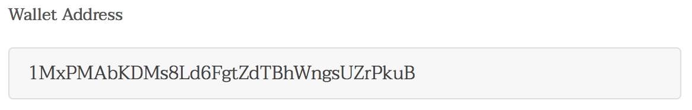

# Project 1 - Managing your blockchain identity

 This is the first project in the UDACITY Blockchain Nanodegree. The project is to create your blockchain identity and is a encrypted private-public key pair that generates a wallet address which allows anonymously interaction with information on the blockchain. 
 
 ## Step 1: Install Electrum

 > Download the Electrum from: https://electrum.org/#download
 
 From the Easy Installation option, download the correct version applicable for your OS. In this write up I downloaded the "Executable for OS X"

> Once the installation is extracted and installed, open Electrum, click New and enter a name for your wallet. For this tutorial I used the name wallet_p1, click next 

> Select the option "standard wallet" and click next

> Select the option "Create a new Seed" and click next

> on the dialog, choose Seed Type, select the "Standard option" and click next

> Electrum generated a seed and is composed of 12 random words and is used to generate your privat keys. NEVER expose or share the seed, as your wallet can be fully recovered from its seed. Note the words in a correct order an a pager and store it at a save location. Click next

> The next step is to confrim the seed, Type the seed phrase and click next. The button next becomes available as soon the seed phrase is correct.

According the Electrum website: the seed phrase created by Electrum has 132 bits of entropy

> The process is almost finished, in the following step, you are asked to provide a "strong" password, and click next

 The password is there to protect the wallet. It's not possible to recover the password, but you can restore your wallet from its seed phrase and then choose a new password. Loosing both, seed phrase and password is NOT recoverable and everything in your wallet is lost.

> Wallet created 

## Step 2: walk through the wallet interface and find the wallet address. Please by so kind and share some bitcoins!

The wallet interface looks straightforward, but it's a good idea to read some documentation first: http://docs.electrum.org/en/latest/index.html

The following screenshot provides a wallet address

## Step 3: Navigate to the web application 
(https://bitcoin-message-validation.firebaseapp.com) and use your wallet address to generate a message.

The page is asking for three inputs:
> 1. the wallet address: 
enter the wallet address as you see in the picture above

> 2. a message signed by your wallet

> 3. a signature
This will be covered in step 4

## Step 4: Use your wallet to sign the message.

> from your wallet in Electrum, goto the tab Addresses

> Choose the address from the address list, and right click to open the menu, and select the option "sign/Verify message"

> It prompts with an input form. Enter your message in the message field and click sign. 

Copy the message from the web app as shown above: 1MxPMAbKDMs8Ld6FgtZdTBhWngsUZrPkuB: Udacity rocks!

> Enter your wallet password and click ok.

> your message will be signed and the signature is displayed in the signature box. Copy the message and continue with step 5

Signature: IJHkuwcbNxDmtgglXeuoCZOVZczAUdYmSvaUWHOxznDFaFq/DyCIJIFkFvSx++TyD/23ZjAKbiJtygxm5gYvhcU=

## step 5: Validate the message signature with the udacity web application

> Enter the signature in the signature block and click, "validate Wallet" 

If everything works out fine than you should the following result:

## step 6: document the process

as instructed, the result must be provided in either txt or md format. I used .md and uploaded to github. 

## Step 7: submit project document
Done

